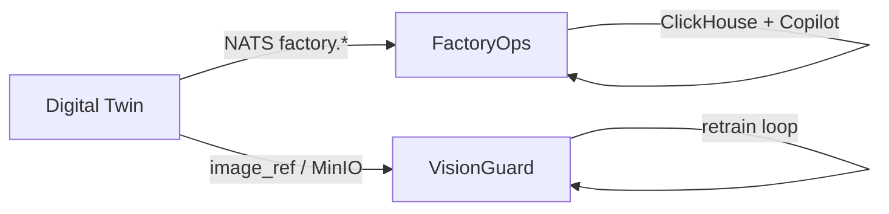

<div align="center">

# Factory AI Portfolio

### Three integrated manufacturing-AI repos — one synthetic plant, one demo script

[](factory-digital-twin/)
[](factory-ops/)
[](visionguard/)

<br />


<br />

| Repo | Role |
|:----:|------|
| [`factory-digital-twin/`](factory-digital-twin/) | Synthetic MES events, ground-truth OEE, defect images |
| [`factory-ops/`](factory-ops/) | OEE dashboard, downtime analytics, agentic Copilot |
| [`visionguard/`](visionguard/) | YOLO inspection, inspector corrections, retrain loop |

<br />

*Coordination docs:* [`portfolio/plan.md`](portfolio/plan.md) · [`portfolio/GUARDRAILS.md`](portfolio/GUARDRAILS.md) · [`portfolio/REVIEW.md`](portfolio/REVIEW.md)

</div>

---

> **Separate experiment:** [`factory-genius/`](factory-genius/) — maintenance copilot · published at [`github.com/vgandhi1/factory-genius`](https://github.com/vgandhi1/factory-genius) · **not** part of the three-repo integration story.

Each sub-repo is an **independent git repository** and follows [governance standards](../governance/standards/COMPLIANCE.md) on its own.

---

## One-command demo

```bash
factory-ops/scripts/demo-all.sh up        # FactoryOps + Digital Twin stacks
factory-ops/scripts/demo-all.sh seed-vg   # Twin defect images → VisionGuard MinIO
factory-ops/scripts/demo-all.sh down      # stop everything
```

| UI | URL |
|----|-----|
| FactoryOps dashboard | http://localhost:3000 |
| VisionGuard inspector | http://localhost:3001 |

Verified baseline (seed 42): ~8.9k events · OEE ≈ **0.68** · Copilot eval **25/25**. Details in [`portfolio/plan.md`](portfolio/plan.md).

---

## Data flow



---

## Portfolio docs

| Document | Purpose |
|----------|---------|
| [`portfolio/plan.md`](portfolio/plan.md) | Status, milestones, open work |
| [`portfolio/Scoped_Executable_Portfolio.md`](portfolio/Scoped_Executable_Portfolio.md) | Original scoped architecture |
| [`portfolio/REVIEW.md`](portfolio/REVIEW.md) | Code review (June 2026) |
| [`portfolio/GUARDRAILS.md`](portfolio/GUARDRAILS.md) | Scope boundaries |
| [`factory-digital-twin/EVENT_CONTRACT.md`](factory-digital-twin/EVENT_CONTRACT.md) | Shared NATS contract (SSOT) |

---

## Governance

- [Factory portfolio guardrails](../governance/Guardrails/specialized/factory-portfolio/factory-ai-portfolio-guardrails.md)
- [Repo hygiene standards](../governance/standards/COMPLIANCE.md)
- [Per-project CLAUDE configs](../governance/Guardrails/specialized/factory-portfolio/project-configs/)

---

## Scope tests (guardrails)

| Repo | Ask before adding a feature |
|------|----------------------------|
| **Digital Twin** | *Does this produce realistic factory data that makes the other two projects more credible?* |
| **FactoryOps** | *Does this help an ops manager understand why a line went down or how well it's running?* |
| **VisionGuard** | *Does this help an inspector trust, verify, or correct a defect call?* |
